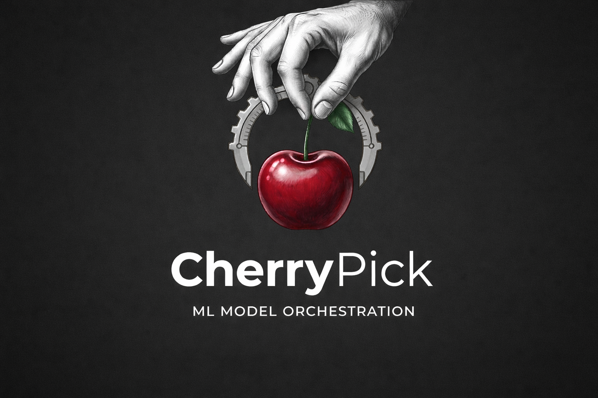

<p align="center">
  
</p>

-----------------

# cherrypick-ml: A Machine Learning Orchestration and Pipeline Toolkit

| | |
| --- | --- |
| Testing | Structured validation of preprocessing, orchestration, and explainability components |
| Package | PyPI distribution for cherrypick-ml |
| Meta | MIT License, Python-based machine learning pipeline framework |

---

## What is it?

**cherrypick-ml** is a Python package that provides a unified interface for building, managing, and evaluating machine learning workflows. It integrates preprocessing, anomaly detection, model orchestration, and explainability into a single, modular framework.

The library is designed to simplify real-world machine learning development by reducing repetitive code while maintaining flexibility and transparency in model pipelines.

---

## Table of Contents

- [Main Features](#main-features)
- [Core Components](#core-components)
- [Where to get it](#where-to-get-it)
- [Dependencies](#dependencies)
- [Installation from sources](#installation-from-sources)
- [Basic Usage](#basic-usage)
- [License](#license)
- [Documentation](#documentation)

---

## Main Features

cherrypick-ml provides the following core capabilities:

- Automated model orchestration for classification and regression tasks  
- Integrated preprocessing utilities including encoding and missing value handling  
- Outlier detection using statistical method such as Inter quartile range(IQR), Z-score, modified Z-score, Isolation  Forest and Local Outlier Factor based outlier pruning  
- SHAP-based explainability for feature importance and model interpretation  
- Flexible train-test splitting utilities  
- Modular design allowing independent usage of components  
- Designed for practical, real-world machine learning workflows  

---

## Core Components

The library is structured into the following modules:

- **Orchestrator**  
  High-level interface for training, evaluating, and selecting models with explainable visualisation

- **preprocessing**  
  Tools for encoding, imputation, and feature preparation  

- **anomaly**  
  Outlier detection and data pruning utilities  

- **explain**  
  Model explainability using SHAP-based analysis  

- **splits**  
  Utilities for dataset partitioning  

---

## Where to get it

The source code is currently hosted on GitHub at:

https://github.com/Sujal-G-Sanyasi/cherrypick-ml

Binary installers for the latest released version are available at the Python Package Index (PyPI):

```sh
pip install cherrypick-ml
